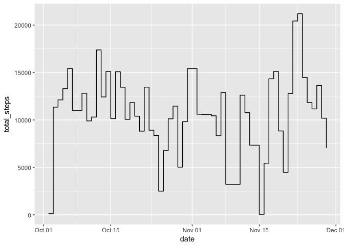
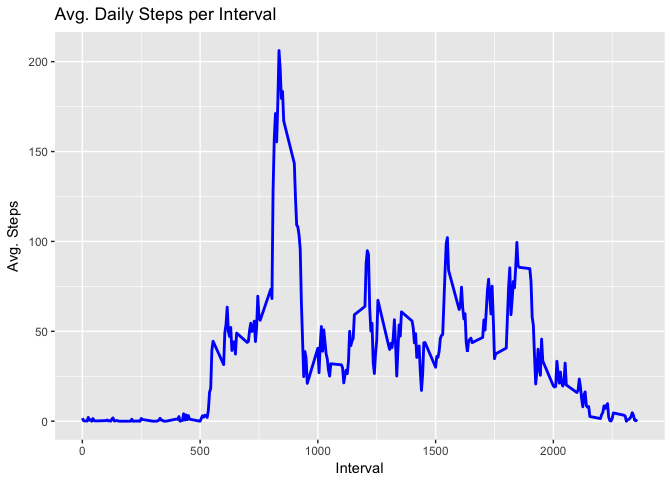
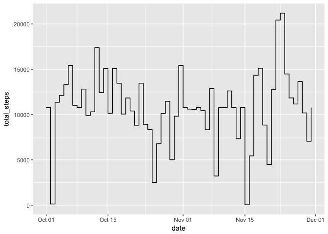
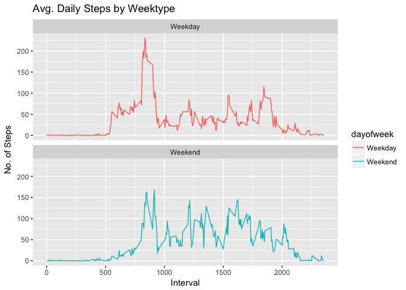

# Reproducable Research Project1
JP Van Steerteghem  
9/2/2017  


##Introduction

It is now possible to collect a large amount of data about personal movement using activity monitoring devices such as a [Fitbit][1], [Nike Fuelband][2], or [Jawbone Up][3].

These type of devices are part of the “quantified self” movement – a group of enthusiasts who take measurements about themselves regularly to improve their health, to find patterns in their behavior, or because they are tech geeks. But these data remain under-utilized both because the raw data are hard to obtain and there is a lack of statistical methods and software for processing and interpreting the data.

This assignment makes use of data from a personal activity monitoring device. This device collects data at 5 minute intervals through out the day. The data consists of two months of data from an anonymous individual collected during the months of October and November, 2012 and include the number of steps taken in 5 minute intervals each day.

The data for this assignment can be downloaded from the course web site:

Dataset: [Activity monitoring data] [4] [52K]
The variables included in this dataset are:

- steps: Number of steps taking in a 5-minute interval (missing values are coded as 𝙽𝙰)

- date: The date on which the measurement was taken in YYYY-MM-DD format

- interval: Identifier for the 5-minute interval in which measurement was taken

The dataset is stored in a comma-separated-value (CSV) file and there are a total of 17,568 observations in this dataset.

[1]:http://www.fitbit.com/ "Fitbit"
[2]:http://www.nike.com/us/en_us/c/nikeplus-fuelband/ "Nike Fuelband"
[3]:https://jawbone.com/up/ "Jawbone up"
[4]:https://d396qusza40orc.cloudfront.net/repdata%2Fdata%2Factivity.zip/ "Activity monitoring data"

##Loading and preprocessing the data


```r
setwd("/Users/jvanstee/datasciencecoursera/RepData_PeerAssessment1")
library(dplyr)
```

```
## 
## Attaching package: 'dplyr'
```

```
## The following objects are masked from 'package:stats':
## 
##     filter, lag
```

```
## The following objects are masked from 'package:base':
## 
##     intersect, setdiff, setequal, union
```

```r
unzip(zipfile="./activity.zip",exdir="./data")
activity<- read.csv("./data/activity.csv")  
head(activity)
```

```
##   steps       date interval
## 1    NA 2012-10-01        0
## 2    NA 2012-10-01        5
## 3    NA 2012-10-01       10
## 4    NA 2012-10-01       15
## 5    NA 2012-10-01       20
## 6    NA 2012-10-01       25
```

```r
#Process/transform the data (if necessary) into a format suitable for further analysis
str(activity)
```

```
## 'data.frame':	17568 obs. of  3 variables:
##  $ steps   : int  NA NA NA NA NA NA NA NA NA NA ...
##  $ date    : Factor w/ 61 levels "2012-10-01","2012-10-02",..: 1 1 1 1 1 1 1 1 1 1 ...
##  $ interval: int  0 5 10 15 20 25 30 35 40 45 ...
```

```r
#Change date from factor to Date format
activity$date<- as.Date(activity$date)
#verify
str(activity)
```

```
## 'data.frame':	17568 obs. of  3 variables:
##  $ steps   : int  NA NA NA NA NA NA NA NA NA NA ...
##  $ date    : Date, format: "2012-10-01" "2012-10-01" ...
##  $ interval: int  0 5 10 15 20 25 30 35 40 45 ...
```
##What is mean total number of steps taken per day?

###Calculate the total number of steps taken per day

```r
Total_Steps_Day<- activity%>%
  group_by(date)%>%
  filter(!is.na(steps))%>%
  summarise(total_steps = sum(steps, na.rm=TRUE))
Total_Steps_Day
```

```
## # A tibble: 53 × 2
##          date total_steps
##        <date>       <int>
## 1  2012-10-02         126
## 2  2012-10-03       11352
## 3  2012-10-04       12116
## 4  2012-10-05       13294
## 5  2012-10-06       15420
## 6  2012-10-07       11015
## 7  2012-10-09       12811
## 8  2012-10-10        9900
## 9  2012-10-11       10304
## 10 2012-10-12       17382
## # ... with 43 more rows
```

### Make a histogram of the total number of steps taken each day

```r
#hist(Total_Steps_Day$total_steps)
library(ggplot2)
ggplot(Total_Steps_Day, aes(x = date, y = total_steps))+geom_step()
```

<!-- -->

###Calculate and report the mean and median of the total number of steps taken per day

```r
Mean_Steps<- mean(Total_Steps_Day$total_steps, na.rm=TRUE)
Mean_Steps
```

```
## [1] 10766.19
```

```r
Median_Steps<- median(Total_Steps_Day$total_steps, na.rm=TRUE)
Median_Steps
```

```
## [1] 10765
```

##What is the average daily activity pattern?

###Make a time series plot of the 5-minute interval (x-axis) and the average number of steps taken, averaged across all days (y-axis)


```r
Interval_Average<- activity%>%
  group_by(interval)%>%
  filter(!is.na(steps))%>%
  summarise(avg_steps_interval = mean(steps, na.rm=TRUE))

ggplot(Interval_Average, aes(x =interval , y=avg_steps_interval)) +
  geom_line(color="blue", size=1) +
  labs(title = "Avg. Daily Steps per Interval", x = "Interval", y = "Avg. Steps")
```

<!-- -->

###Which 5-minute interval, on average across all the days in the dataset, contains the maximum number of steps?

```r
Interval_Average[which.max(Interval_Average$avg_steps_interval),]
```

```
## # A tibble: 1 × 2
##   interval avg_steps_interval
##      <int>              <dbl>
## 1      835           206.1698
```

##Imputing missing values

Note that there are a number of days/intervals where there are missing values (coded as 𝙽𝙰). The presence of missing days may introduce bias into some calculations or summaries of the data.

###Calculate and report the total number of missing values in the dataset (i.e. the total number of rows with 𝙽𝙰s)

```r
sum(is.na(activity$steps))
```

```
## [1] 2304
```
###Devise a strategy for filling in all of the missing values in the dataset. 
Imputing missing values using mean for each day.

```r
##presence of NAs in original activity dataset
head(activity)
```

```
##   steps       date interval
## 1    NA 2012-10-01        0
## 2    NA 2012-10-01        5
## 3    NA 2012-10-01       10
## 4    NA 2012-10-01       15
## 5    NA 2012-10-01       20
## 6    NA 2012-10-01       25
```

```r
nas<- is.na(activity$steps)
avg_interval<- tapply(activity$steps, activity$interval, mean, na.rm=TRUE, simplify = TRUE)
```

###Create a new dataset that is equal to the original dataset but with the missing data filled in.

```r
activity_new <-activity
activity_new$steps[nas] <- avg_interval[as.character(activity$interval[nas])]
#verify removal of NAs in new activity dataset
head(activity_new)
```

```
##       steps       date interval
## 1 1.7169811 2012-10-01        0
## 2 0.3396226 2012-10-01        5
## 3 0.1320755 2012-10-01       10
## 4 0.1509434 2012-10-01       15
## 5 0.0754717 2012-10-01       20
## 6 2.0943396 2012-10-01       25
```

```r
#check if no NAs appear
sum(is.na(activity_new))
```

```
## [1] 0
```

###Make a histogram of the total number of steps taken each day

```r
Total_Steps_Day_New<- activity_new%>%
  group_by(date)%>%
  summarise(total_steps = sum(steps, na.rm=TRUE))
Total_Steps_Day_New
```

```
## # A tibble: 61 × 2
##          date total_steps
##        <date>       <dbl>
## 1  2012-10-01    10766.19
## 2  2012-10-02      126.00
## 3  2012-10-03    11352.00
## 4  2012-10-04    12116.00
## 5  2012-10-05    13294.00
## 6  2012-10-06    15420.00
## 7  2012-10-07    11015.00
## 8  2012-10-08    10766.19
## 9  2012-10-09    12811.00
## 10 2012-10-10     9900.00
## # ... with 51 more rows
```

```r
#hist(Total_Steps_Day_New$total_steps)
ggplot(Total_Steps_Day_New, aes(x = date, y = total_steps))+geom_step()
```

<!-- -->

###Calculate and report the mean and median total number of steps taken per day. 
Do these values differ from the estimates from the first part of the assignment? What is the impact of imputing missing data on the estimates of the total daily number of steps?

**As you can see below the mean number of steps per day do not differ between the two methodologies.**


```r
Mean_Steps_New<- mean(Total_Steps_Day_New$total_steps, na.rm=TRUE)
Mean_Steps_New
```

```
## [1] 10766.19
```

```r
Mean_Steps<- mean(Total_Steps_Day$total_steps, na.rm=TRUE)
Mean_Steps
```

```
## [1] 10766.19
```

**However the median differs slightly between the two methodologies.**


```r
Median_Steps_New<- median(Total_Steps_Day_New$total_steps, na.rm=TRUE)
Median_Steps_New
```

```
## [1] 10766.19
```

```r
Median_Steps<- median(Total_Steps_Day$total_steps, na.rm=TRUE)
Median_Steps
```

```
## [1] 10765
```

##Are there differences in activity patterns between weekdays and weekends?

For this part the 𝚠𝚎𝚎𝚔𝚍𝚊𝚢𝚜() function may be of some help here. Use the dataset with the filled-in missing values for this part.

###Create a new factor variable in the dataset with two levels – “weekday” and “weekend” indicating whether a given date is a weekday or weekend day.

```r
activity_new<- activity_new%>%
  mutate(dayofweek= ifelse(weekdays(activity_new$date)=="Saturday" | weekdays(activity_new$date)=="Sunday", "Weekend", "Weekday"))
```
###Plot average number of steps taken for each 5-minute interval.
Make a panel plot containing a time series plot (i.e. 𝚝𝚢𝚙𝚎 = "𝚕") of the 5-minute interval (x-axis) and the average number of steps taken, averaged across all weekday days or weekend days (y-axis). 


```r
Interval2<- activity_new%>%
  group_by(interval, dayofweek)%>%
  summarise(avg_steps_new = mean(steps, na.rm=TRUE))

ggplot(Interval2, aes(x =interval , y=avg_steps_new, color=dayofweek)) +
  geom_line() +
  labs(title = "Avg. Daily Steps by Weektype", x = "Interval", y = "No. of Steps") +
  facet_wrap(~dayofweek, ncol = 1, nrow=2)
```

<!-- -->
